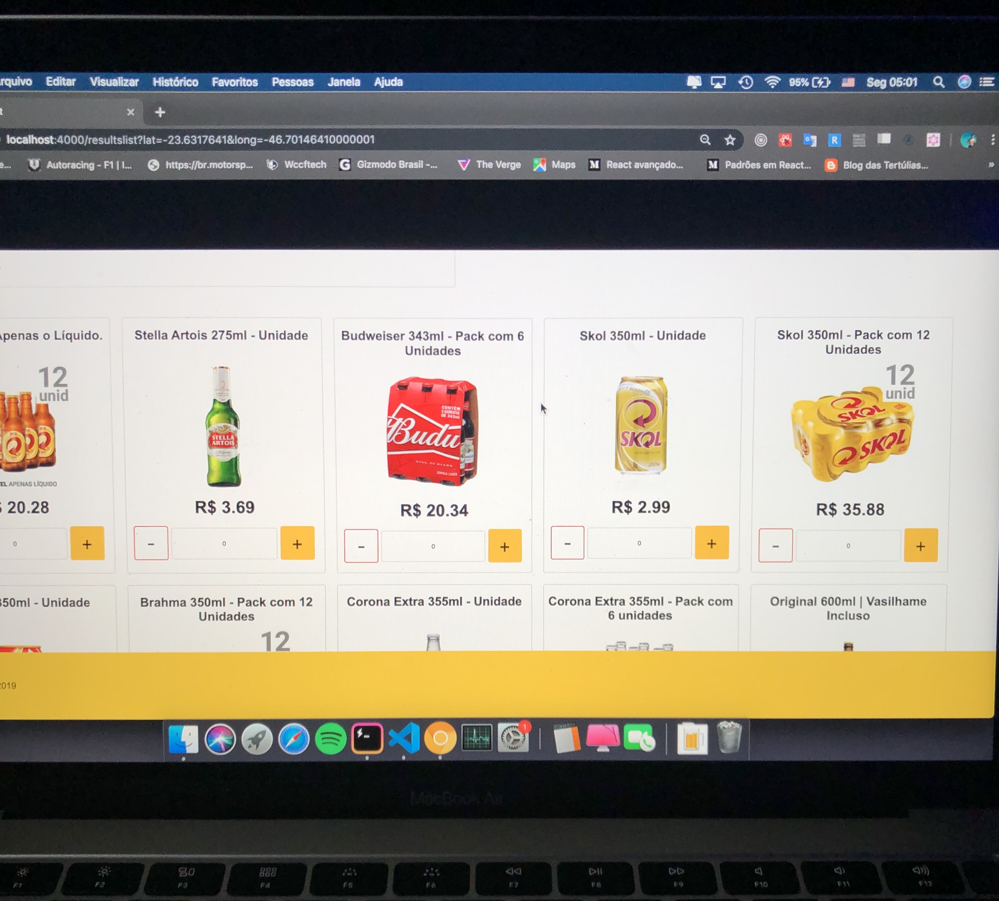

## Start Project
Run `npm install` to install the dependencies.

Run `npm start` for a dev server. Automatically your browser will navigate to `http://localhost:4000/`. 

## Build

Run `npm run build` to build the project. The build artifacts will be stored in the `/build` directory.

## Code Style and Lint.

ESLint is a JavaScript open source linting, and here we user airbnb styleguide (https://github.com/airbnb/javascript/tree/master/packages/eslint-config-airbnb)

## Performace.

Run `npm run-script analyzer` for bundle analyzer.

LazyLoad content

Bundle package has 102kb on gizp enconde.

## This Project have the React Hooks.

Motivation : [Classes confuse both people and machines 💻](https://reactjs.org/docs/hooks-intro.html#classes-confuse-both-people-and-machines)

In addition to making code reuse and code organization more difficult, we’ve found that classes can be a large barrier to learning React. 
You have to understand how this works in JavaScript, which is very different from how it works in most languages. 
You have to remember to bind the event handlers. Without unstable syntax proposals, the code is very verbose. 
People can understand props, state, and top-down data flow perfectly well but still struggle with classes. 
The distinction between function and class components in React and when to use each one leads to disagreements even between experienced React developers.

##  Screen

